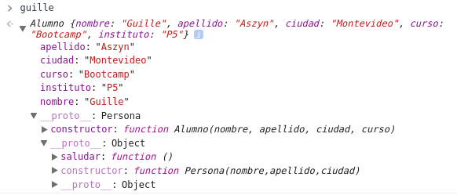

## Prototype Inheritance

### Creando Objetos

Hasta ahora siempre que teníamos que crear un objeto nuevo declarábamos un object literal, pero vamos a ver que hay otros métodos que nos da el prototype de Object para cumplir esa tarea

##### Object.create

El método `create` de los objetos nos permite crear un nuevo objeto a partir de un prototype especificado.

``` javascript
// creo un objecto con un objeto vacio como proto
> var obj = Object.create({})

> obj
< Object {}

// creo que un objeto a partir de un proto de Objeto
> var obj = Object.create(Object.prototype)
// que es lo mismo que crear un objeto vacio literal
> var obj = {}
```

##### Object.assign

El método `assign` de los objetos te permite agregar propiedades a un objeto pasado por parámetro

``` javascript
> var obj = {}

// No hace falta guardar el resultado porque los objetos se pasan por `referencia`
> Object.assign(obj, {nombre:'facu', apellido:'velasco'})

> obj.nombre
< 'facu' 
```

## Herencia Clásica

En el paradigma de _Programación Orientada a Objetos_ un tema muy importante es la _Herencia y Polimorfismo_ y de las clases (los vamos a llamar constructores por ahora).

Cuando hacemos referencia a **Herencia** nos referimos a la capacidad de un constructor de _heredar_ propiedades y métodos de otro constructor, así como un Gato es Mamífero antes que Gato, y hereda sus 'propiedades' (nace, se reproduce y muere).

Cuando hablamos de **Polimorfismo** nos referimos a la capacidad de que objetos distintos puedan responder a un llamado igual de acuerdo a su propia naturaleza. 

## Herencia en JavaScript

En JS a diferencia de la herencia clásica nos manejamos con prototipos, que van a tomar los métodos pasados por sus 'padres' mediante la `Prototype Chain`.

Cuando generamos un arreglo nuevo podemos acceder a métodos como `map` o `slice` gracias a que los heredamos del Objeto `Array` que esta vinculado en la propiedad `__proto__` y es el siguiente en el `Prototype Chain`.

Nosotros también podemos generar nuestros propios constructores que de los cuales heredar. Creemos un constructor de el cual pueda haber variantes.

``` javascript
> function Persona(nombre,apellido,ciudad) {
    this.nombre = nombre;
    this.apellido = apellido;
    this.ciudad = ciudad;
  }

> Persona.prototype.saludar = function() {
    console.log('Soy '+this.nombre+' de '+this.ciudad);
  }

> var facu = new Persona('Facundo', 'Velasco', 'Buenos Aires');

> facu.saludar()
< 'Soy Facundo de Buenos Aires'
```

Ahora todo Alumno de javascript 5 antes de Alumno es un Persona, asique podríamos decir que un Alumno hereda las propiedades de ser Persona.

``` javascript
> function Alumno(nombre,apellido,ciudad,curso) {
    // podría copiar las mismas propiedades de Persona acá adentro
    this.nombre = nombre;
    this.apellido = apellido;
    this.ciudad = ciudad;
    this.curso = curso
  }
```

#### Constructores Anidados

Pero en este caso estaríamos repitiendo código, y si en un futuro quisiera cambiar una propiedad tendría que hacerlo en ambos constructores.
Descartemos esta opción.

``` javascript
// lo que nosotros queremos es poder reutilizar las propiedades de persona,
> function Alumno(nombre, apellido, ciudad, curso) {
    // usemos nuestro constructor Persona dentro del de Alumno
    Persona.call(this, nombre, apellido, ciudad);
    // vamos a necesitar el call porque queremos que las propiedades de persona, queden en bajo el objeto que va a devolver Alumno, y no uno nuevo del constructor Persona.
    // luego le paso los valores que quiero que reciba el constructor de Alumno
    
    // finalmente le agrego los puntos propios de Alumno
    this.curso = curso;
    this.instituto = 'P5';
  }

> var toni = new Alumno('Toni', 'Tralice', 'Tucuman', 'Bootcamp')

// Ahora si tenemos nuestra instancia creada a partir de ambos constructores
> toni.curso
< Bootcamp

> toni.apellido
< Tralice

> toni.saludar()
< Uncaught TypeError: toni.saludar is not a 'function'
// que paso?
```

Como podemos ver los métodos de _Personas_ no fueron pasados a nuestros _Alumnos_. Veamos un poco el porqué.


Como podemos ver en la imagen, el constructor del `__proto__` esta ligado a Alumno y luego al `Object Object` de JS. Pero el método `saludar` esta en el objeto `prototype` de Personas... , y esta perfecto, así es como debería funcionar, las instancias acceden al `__proto__` que fue vinculado por el constructor para ver que métodos tienen. Nuestro problema es que al llamar a Persona con `call` en vez de con el método `new` no se esta haciendo ese vinculo en el que `Persona.prototype` se mete en nuestro `Prototype Chain`, y entonces las instancias de Alumno no tienen acceso a los métodos de Persona

Vamos a solucionar ese problema agregando al prototipo los métodos de Persona, para esto vamos a usar el método `Object.create`.

``` javascript
// usamos `Object.create` porque este guardaba el argumento pasado como `__proto__` del objeto a retornar
> Alumno.prototype = Object.create(Persona.prototype)

// si recuerdan el objeto prototype siempre tenia una propiedad constructor que hacia referencia a la función en si, con la asignación que hicimos arriba lo pisamos, por lo que deberíamos volver a agregarlo.
> Alumno.prototype.constructor = Alumno

> var guille = new Alumno('Guille','Aszyn','Montevideo','Bootcamp')

> guille.saludar()
< 'Soy Guille de Montevideo'
```

Ahora tenemos una instancia que puede usar los métodos del otro constructor sin necesidad de volverlos a escribir para ella misma.



Para completar nuestro ejemplo creemos un método que solo pueda acceder un Alumno.

``` javascript
> Alumno.prototype.inscribirme = function (curso) {
    cursosArr = ['Bootcamp','Introductorio','Backend']
    // si el curso esta entre alguno de los ofrecidos 
    if (cursosArr.includes(curso)) {
      this.curso = curso;
    } else {
      console.log('No tenemos ese curso :(')
    }
  }

> guille.curso
< 'Bootcamp'

> guille.inscribirme('Introductorio')

> guille.curso
< 'Introductorio'

// y ahora probemoslo para alguien que no sea alumno

> var facu = new Persona('Facundo', 'Velasco', 'Buenos Aires')

> facu.inscribirse('Backend');
< Uncaught TypeError: facu.inscribirse is not a 'function'
  // Excelente!
```

